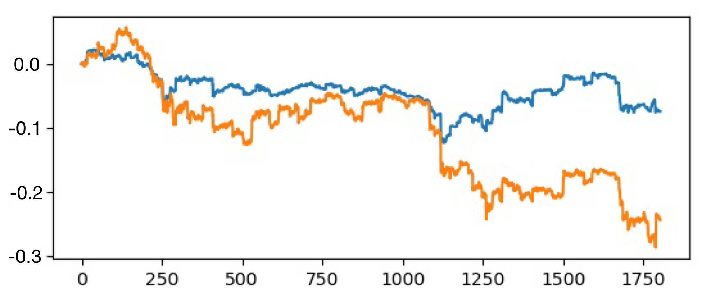

# Deep Q Learning Bitcoin Trading Agent

This is the first half of my capstone project which is a continuation of the RIPS-HK 2018 group project. In this project, I focus on trying different ways to implement the deep Q-learning algorithm of the Bitcoin trading agent. Two kinds of neural networks are used: ResNet and recurrent neural network (RNN). I tried two approaches to implement the Q-network: the first one is to use the Q-network to map the state to the Q-values of all actions, the other one is to use the Q-network to map both the state and a specific action to a single Q-value. It turns out that the latter scheme has a better performance in this project. And instead of using the past experience to do memory reply, I tried to use the pre-known optimal policy which turned out to have a much better performance.

## Action space:

    {BUY, SELL}

## State:

## Q-network:

Map both state and action to a single Q value.

    
    

## Memory replay:

    use the optimal policy instead of the past experience. (details see SCIE3500_Final_Report.pdf, Section 5.3)

## Usage:

    Train: python train.py
    
    Test: python test.py, python test2.py
    
    Tune parameters: Change values in constants.py

## Test result:

The orange curve is the percentage price change comparing to the initial price. And the blue curve is the percentage change of the asset value comparing to the initial asset.